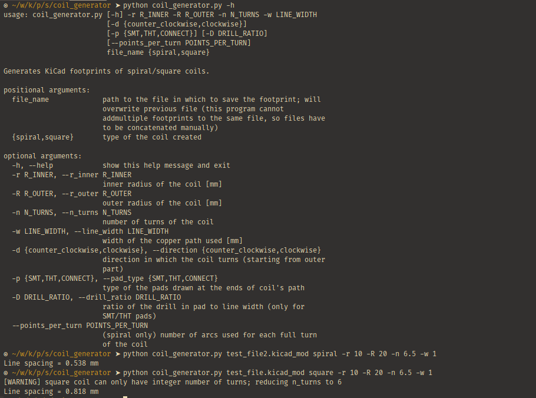
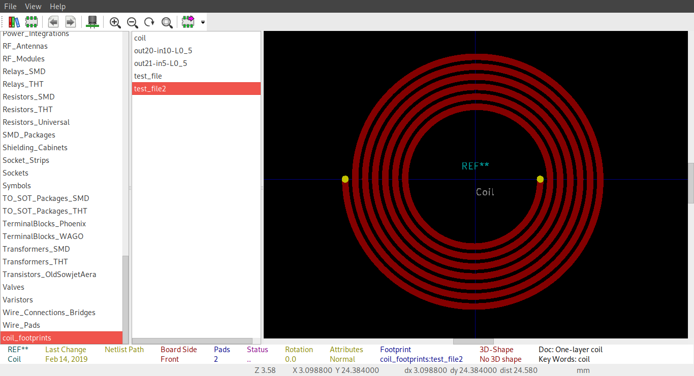
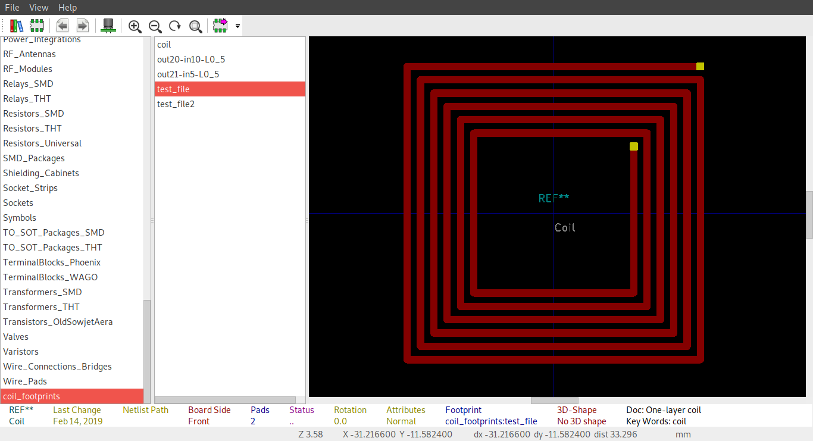

# KiCad coil generator

This is a simple script for generating KiCad one-layer coil footprints for use in PcbNew.

The program allows to generate either spiral or square (square-spiral?) coils. Coils are described by inner and outer radius, number of turns and line width.
For other options see help.

The program uses KiCad Python library that is used for generation of most of the official footprints.

## Usage

> It is usually best to install python dependencies in a python virtual environment!

Clone this repository and install the dependencies:
```bash
pip install -r requirements.txt
```

Then run the program:
```bash
python coil_generator.py --help
```

## Examples






